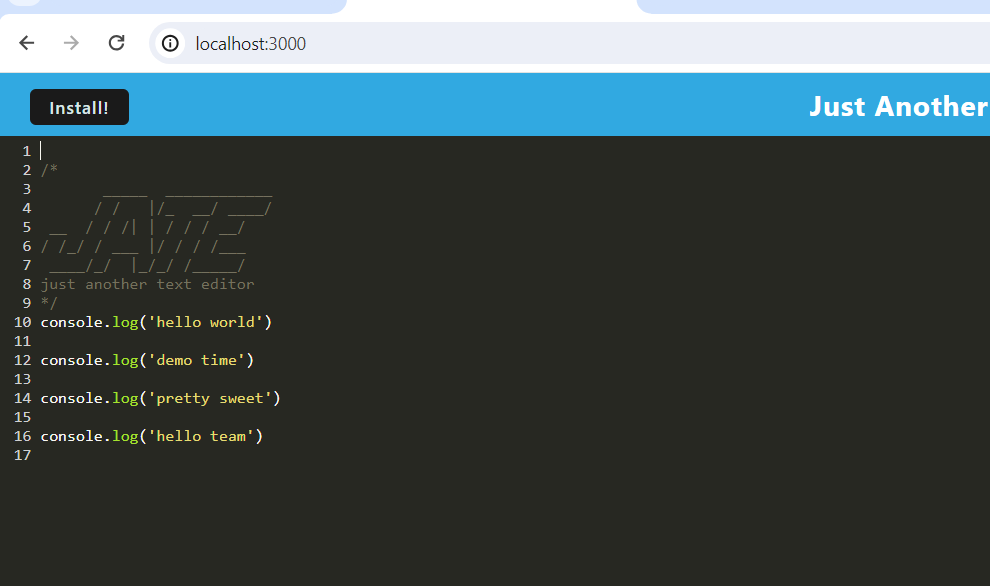
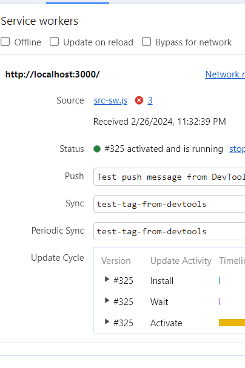
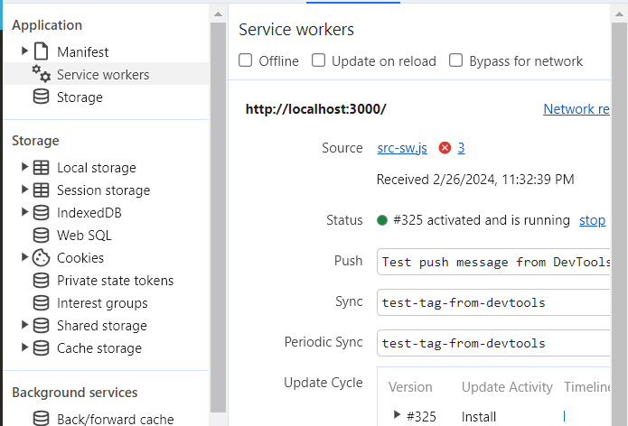
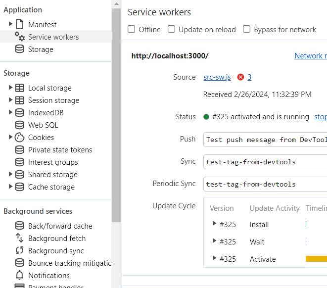
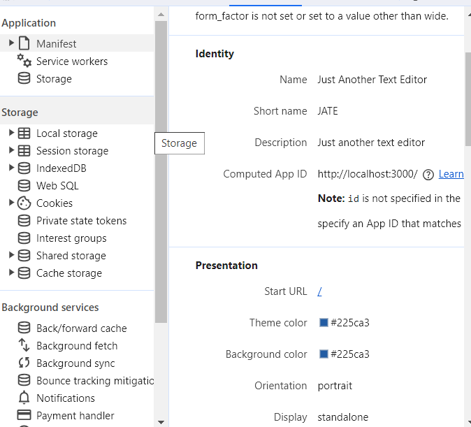
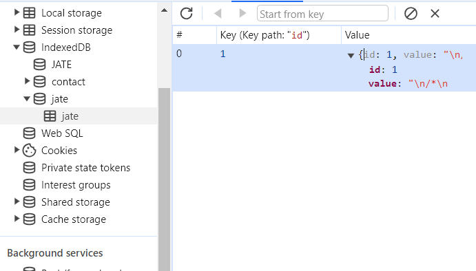
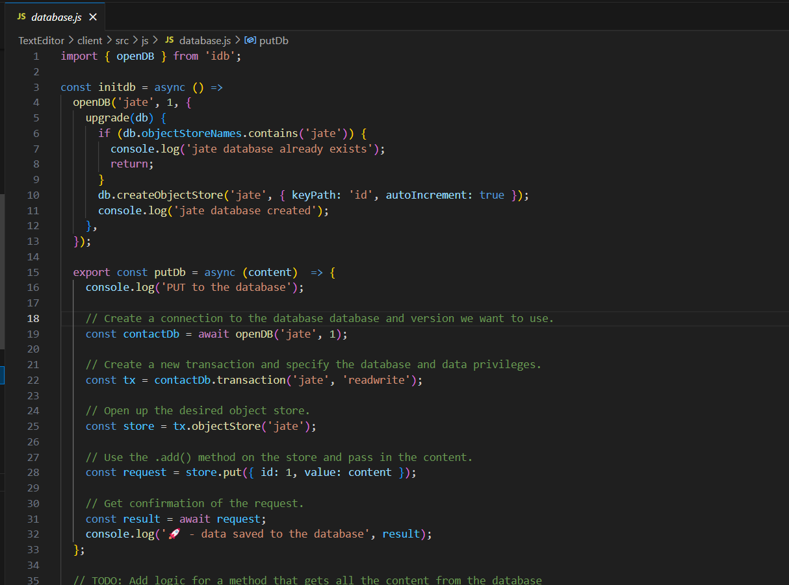
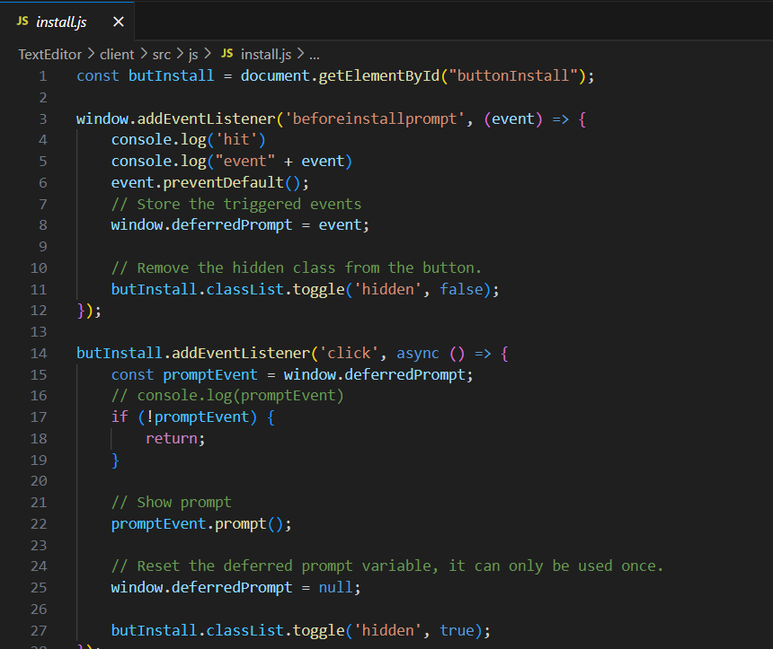
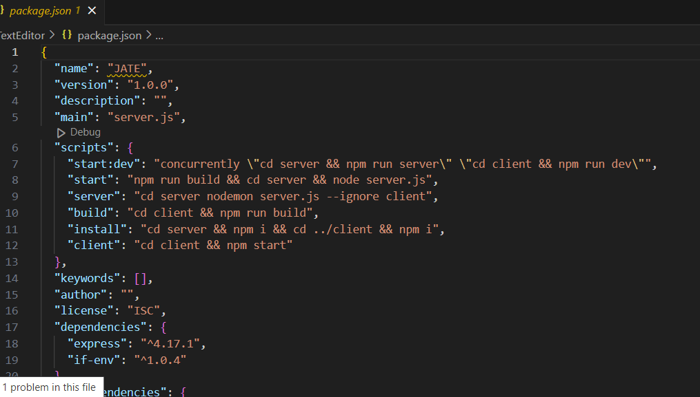

# TextEditor

## Table of Contents (Optional)

- [Description](#description)
- [Installation](#installation)
- [Usage](#usage)
- [Credits](#credits)
- [License](#license)

## Description

I learn Progressive Web Application (PWA) that runs browser offline and can be installed locally to your machine and how to work with server , I learn how to IndexedDB database and idb package ,I build this project to learn how to work with website offline and send message from client to server

## Installation

the project has two installation process one for (node_modules) and it's install using this command in terminal "npm i"
another process is (run application) using "npm run start"

if the project doesnt work run first this "npm run build" or make sure this code inside the "TextEditor/package.json"
"scripts": {
    "start:dev": "concurrently \"cd server && npm run server\" \"cd client && npm run dev\"",
    "start": "npm run build && cd server && node server.js",
    "server": "cd server nodemon server.js --ignore client",
    "build": "cd client && npm run build",
    "install": "cd server && npm i && cd ../client && npm i",
    "client": "cd client && npm start"
  },

## Usage
open the page from "http://localhost:3000/" , the page will show black page can type massage on it and it will save on server database

github :  https://github.com/omeraus6/TextEditor

Deploy Render page : https://texteditor-667n.onrender.com/

image 1: massage area

image 2: service worker

image 3: 

image 4:

image 5: from 3-5 manifest application

image 6: database

image 7: 

image 8: 

image 9: from 7-9 project code

 
## Credits

Thank you for tips and sugestion from Bootcamp instructors and classmates, I hava used https://www.w3schools.com/ , https://stackoverflow.com/ and https://developer.mozilla.org/en-US/docs/Web/CSS/grid-template to reserch information 

## License

Please refer to the LICENSE in the repo.